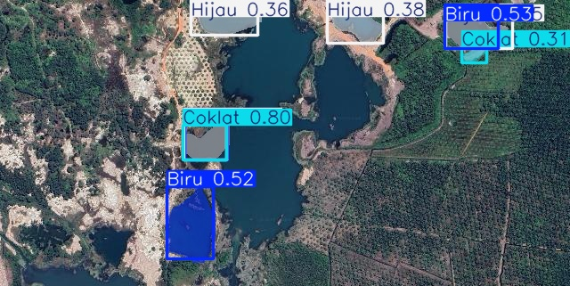
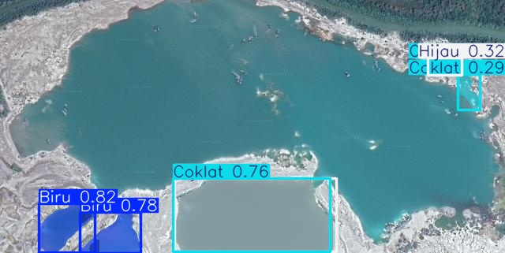
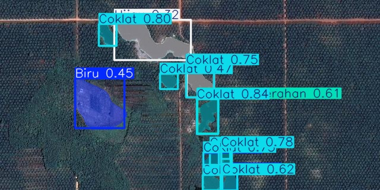
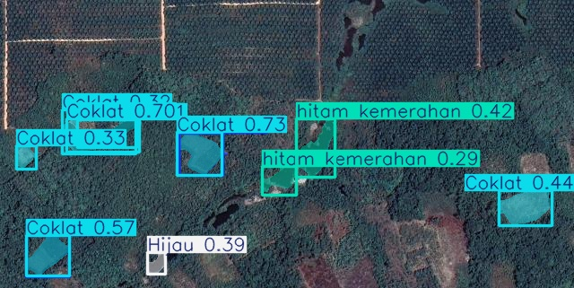
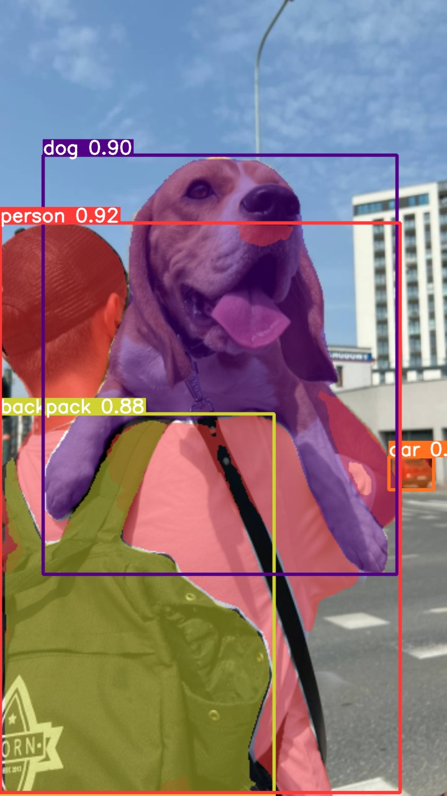

# Color Water Instance Segmentation using YOLOv8

This repository contains code for instance segmentation of images using YOLOv8, the latest version of the YOLO (You Only Look Once) architecture. YOLOv8 was developed by Ultralytics, known for their work on YOLOv3 and YOLOv5. The model is pre-trained on the COCO dataset and fine-tuned on the Color Water dataset.

## Dataset

The dataset used is the [Color Water Computer Vision Project](https://universe.roboflow.com/gilang-dwi-aprianto-eegin/color-water) from Roboflow. It consists of images designed to help in identifying and segmenting different colors of water.

### Dataset Description

- **Images**: A collection of images featuring various colors of water.
- **Purpose**: To train an instance segmentation model that can identify and segment different colors of water in images.

## Model

### Architecture

The model used is YOLOv8, the latest version of the YOLO architecture. YOLOv8 brings significant improvements in accuracy and speed over its predecessors.

### Pre-trained Model

The model is pre-trained on the COCO dataset, a large-scale object detection, segmentation, and captioning dataset. This pre-training helps the model to generalize better on the Color Water dataset.

### Training

The model was trained with the following hyperparameters:
- **Epochs**: 10 (It is recommended to train with more epochs for better accuracy)
  
## Usage

1. Clone the repository:
    ```bash
    git clone https://github.com/AlirezaHabibi1377/Color-Water-Instance-Segmentation-using-YOLOv8.git
    ```

2. Download the dataset from [Roboflow](https://universe.roboflow.com/gilang-dwi-aprianto-eegin/color-water) and place it in the appropriate directory.

# Outputs

## YOLOv8S







## YOLOv8X



## Conclusion

This project demonstrates how to use YOLOv8 for instance segmentation of images in the Color Water dataset. The trained model can help in identifying and segmenting different colors of water in images, which can be useful for various computer vision applications.
